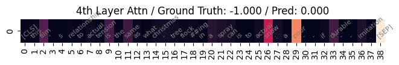
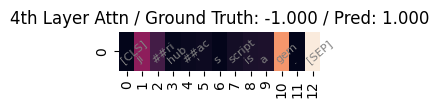

Simple code to visualize attention values of Transformer-based language model.

# Note
The main idea of handling attention values comes from ACL-IJCNLP paper LEWIS: Levenshtein Editing for Unsupervised Text Style Transfer's [codebase](https://github.com/machelreid/lewis).
According to the paper, penultimate (second to the last) layer worked the best. (e.g. 11th layer for Roberta-base.)

# Install Packages
1. `conda env create -n <name> -f requirements.txt`
    - If you want GPU-enabled torch, 
        - `conda activate <name>`
        - `conda install pytorch torchvision torchaudio pytorch-cuda=11.7 -c pytorch -c nvidia` (check [url](https://pytorch.org/get-started/locally/))
3. Or simply check if packages in requirements.txt are already installed in your environment.

# Run
1. `conda activate <name>`
2. `python viz_attention.py`
3. Or open demo.ipynb and run it for demo.

# Sample results
- Data: SST-2 test set
- Model: distilbert-base-uncased-finetuned-sst-2-english  

